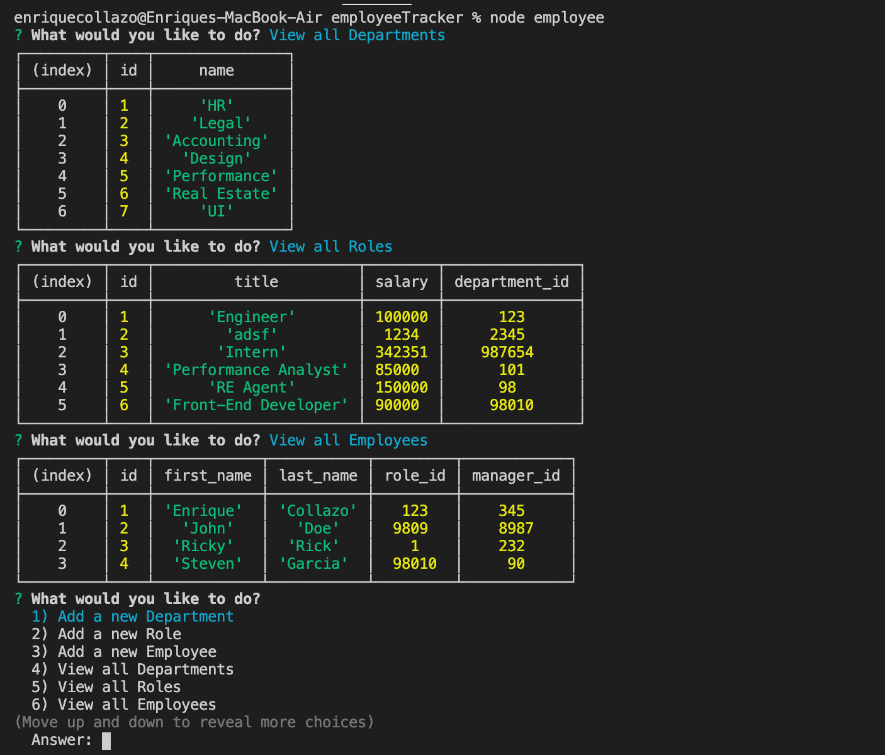
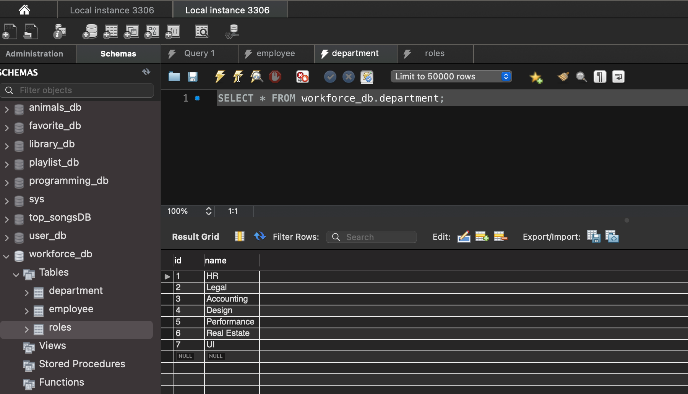

# Unit 12 MySQL Homework: Employee Tracker

In this homework assignment, my challenge was to architect and build a solution for managing a company's employees using node, inquirer, and MySQL. With this application an Employee or Manager would be able to add new departments, roles, and employees; they will also be able to view departments, roles, and employees; and lastly be able to update an exsiting department, role, or employee.

In order for this to work, the user needs to have 

```
Node
MySQL
InquirerJS
```

## Video Example
[Video Example](https://drive.google.com/file/d/1qrLFfwSNopSDLLDrabjueUG4SrFxJrRf/view)

## Photo Preview



## Future Functionalities
  * Update employee managers

  * View employees by manager

  * Delete departments, roles, and employees

  * View the total utilized budget of a department -- ie the combined salaries of all employees in that department
